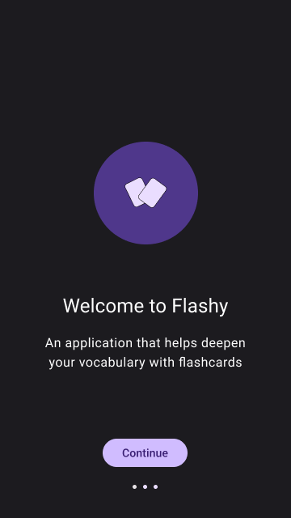
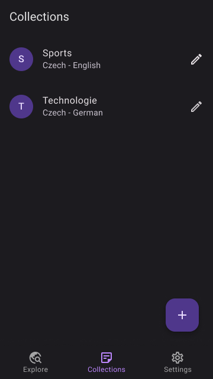
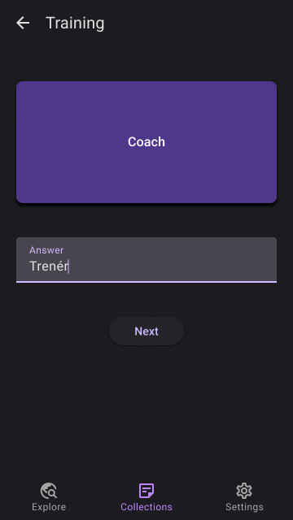
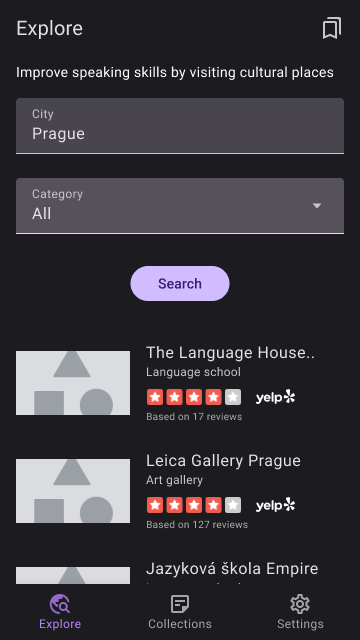

# Project Description

**NOTE**: You need to supplement your own Google API Key in the android manifest and create a variable `API_KEY` in `local.properties` and assign to it your Yelp Fusion API key. 

Flashy Flashcards is a simple application that helps users learn foreign language vocabulary using flashcards. The application supports:
- Short user onboarding
- Creation of vocabulary collections
- Exercises and testing (no hints) of vocabulary collections
- Searching for public places (e.g., cultural centers, libraries) for the purpose of improving oral speech (simple map search)

The app supports English and Czech languages.

Technology:
- Kotlin
- Jetpack Compose
- MLKit Translation API
- Yelp Fusion API
- Automated UI and unit tests

## Design of Selected Screens

 

 

 

